# Sistema Digital Regulador de Tiempo en Pantalla

Sistema digital basado en FPGA para el **control del tiempo de uso de un televisor**, orientado a la construcción de hábitos saludables de consumo de pantallas en niños. El dispositivo interrumpe el flujo de corriente hacia el televisor una vez se agota el tiempo configurado o fuera de la franja horaria permitida, gestionado íntegramente mediante máquinas de estados finitos (FSM) descritas en Verilog.

> Proyecto desarrollado para el curso de Sistemas Digitales — Departamento de Ingeniería Mecánica y Mecatrónica, Universidad Nacional de Colombia.

**Autores:** Daniela Sabogal Suarez · Daniel Felipe Loy Arias · Juan David Garcia Barreto

---

## Tabla de contenido

- [Descripción general](#descripción-general)
- [Arquitectura del sistema](#arquitectura-del-sistema)
- [Interfaz de usuario](#interfaz-de-usuario)
- [Módulos implementados](#módulos-implementados)
- [Máquinas de estado](#máquinas-de-estado)
- [Hardware y circuito](#hardware-y-circuito)
- [Modelado 3D / Carcasa](#modelado-3d--carcasa)
- [Pruebas y validación](#pruebas-y-validación)
- [Resultados](#resultados)
- [Uso de IA](#uso-de-ia)
- [Referencias](#referencias)

---

## Descripción general

El sistema controla el tiempo de uso diario de un televisor mediante una FPGA que integra sensores de entrada (teclado matricial, módulo RTC, pulsadores) y actuadores de salida (relé, pantalla LCD gráfica). El cuidador configura un tiempo máximo de uso y una franja horaria permitida; al agotarse el tiempo o salir del horario configurado, el sistema corta la alimentación del televisor automáticamente.

| Característica | Detalle |
|---|---|
| Plataforma | FPGA Cyclone IV |
| Lenguaje | Verilog (HDL) |
| Entradas | Teclado matricial 4×4, módulo RTC DS1302, pulsadores PLAY/PAUSE |
| Salidas | Relé (corte de alimentación), pantalla LCD gráfica 128×64 |
| Pantallas del sistema | Kids Mode, Password, Main Menu, Adult Mode, Settings |

---

## Arquitectura del sistema

El diagrama de bloques resume la interacción entre sensores, la unidad de control (FPGA) y los actuadores del sistema.

  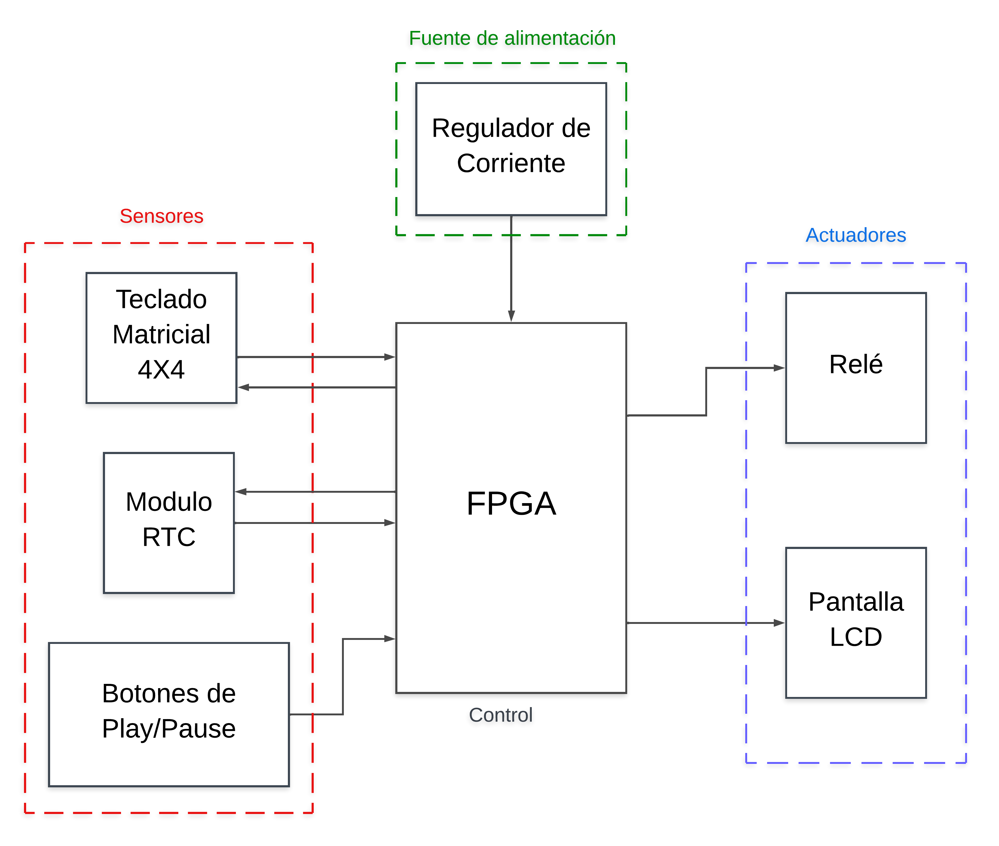

---

## Interfaz de usuario

La navegación se realiza mediante el teclado matricial entre cinco pantallas: **Kids Mode** (pantalla predeterminada, muestra el tiempo restante), **Password** (acceso protegido), **Main Menu**, **Adult Mode** (hora real sin restricciones) y **Settings** (configuración de tiempo máximo y franja horaria en formato HH:MM).

  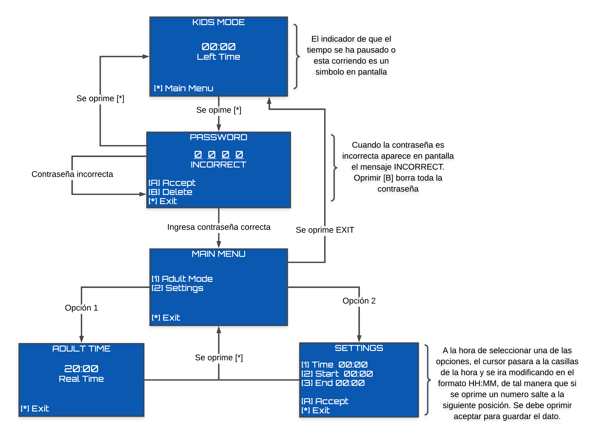

| Pantalla | Función |
|---|---|
| Kids Mode | Tiempo restante + control PLAY/PAUSE | 
| Password | Ingreso de clave (Accept / Delete / Exit) |
| Adult Mode | Hora real, restricciones deshabilitadas |
| Settings | Configuración de tiempo e inicio/fin |

---

## Módulos implementados

| Módulo | Descripción |
|---|---|
| **RTC (DS1302)** | Interfaz serie síncrona de 3 hilos (CE, SCLK, IO) para lectura/escritura del reloj en tiempo real. Actualización automática cada segundo. |
| **LCD 128×64** | Controla dos chips (CS1/CS2 de 64×64 px c/u), inicializa el display y escribe los mapas de bits de cada pantalla, actualizando hora, tiempo restante y cursor. |
| **Keyboard** | Escaneo de matriz 4×4 con divisor de reloj a 1 ms, FSM de escaneo/debounce (20 ciclos) y decodificación a BCD + teclas especiales. |
| **Password** | Captura hasta 4 dígitos, sincronización de señales externas (metaestabilidad) y comparación contra `DEFAULT_PASSWORD`. Combinacional, sin FSM. |
| **Screen Changes / Menú** | FSM principal de navegación entre las 5 pantallas, controlada por `exit`, `correct_password` y `sel`. |
| **Kids Mode (Timer + Franja Horaria)** | Cuenta regresiva del tiempo disponible, soporte de franjas nocturnas (cruce de medianoche), reinicio diario automático a las 00:00. |
| **Relé** | Módulo combinacional: corta la alimentación si `time_finish` en Kids Mode, o durante la pantalla Password. |
| **Settings** | FSM de 2 estados (selección / edición) para configurar Tiempo, Inicio y Final en formato HH:MM, con saturación de valores a rango 24h válido. |

---

## Ubicación de los módulos en el repositorio
 
Referencia rápida de qué módulo hace qué y en qué carpeta del repositorio se encuentra su descripción en Verilog.
 

| Módulo | Función | Ubicación en el repo |
|---|---|---|
| **RTC (DS1302)** | Interfaz serie con el reloj en tiempo real; lectura/escritura de hora y fecha | [`RTC_DS1302/`](RTC_DS1302) |
| **LCD 128×64** | Inicialización y escritura de la memoria gráfica (CS1/CS2) | [`LCD_128X64/`](/LCD_128X64) |
| **Keyboard** | Escaneo del teclado matricial 4×4, debounce y decodificación BCD | [`Keyboard_fsm/`](/Keyboard_fsm) |
| **Password** | Captura y validación de la contraseña de acceso | [`Password_screen/`](/Password_screen) |
| **Screen Changes / Menú** | FSM principal de navegación entre pantallas | [`Screens_Change/`](/Screens_Change/) y [`Menu_screen/`](/Menu_screen/) |
| **Kids Mode (Timer + Franja Horaria)** | Temporizador, verificación de franja horaria y control de PLAY/PAUSE | [`Kids_screen/`](/Kids_screen/) |
| **Settings** | Configuración de tiempo máximo, hora de inicio y fin | [`Settings_screen/`](/Settings_screen/) |
| **Relé** | Control combinacional de la señal de corte de alimentación | [`relee_controller.v`](/relee_controller.v) |
| **Fuente de caracteres (bitmap font)** | Mapa de bits usado por el LCD para renderizar texto | [`LCD12864_BitmapFont.xlsx`](/LCD12864_BitmapFont.xlsx) |
| **Integración final** | Top-level que conecta todos los módulos del sistema | [`FINAL/`](/FINAL/) |

 
---

## Máquinas de estado

<b>Controlador RTC y configuración de hora

  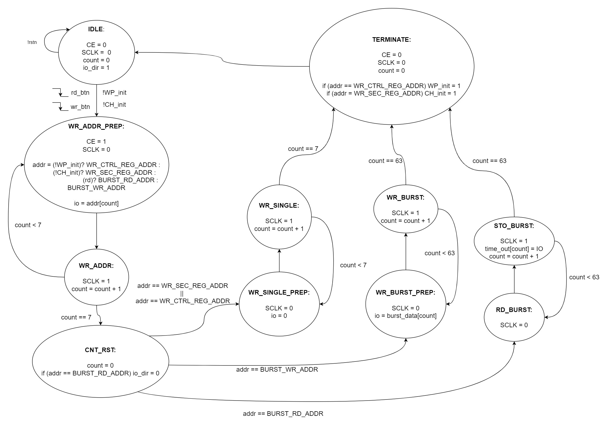
  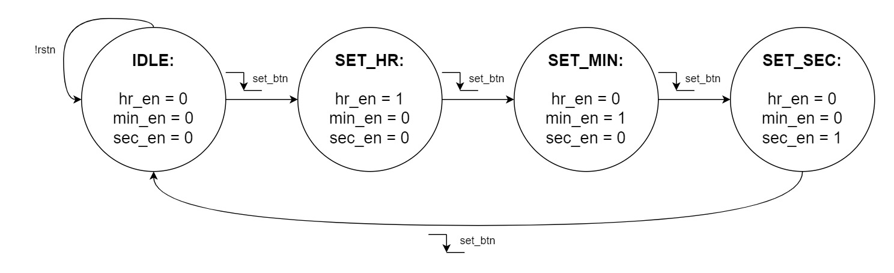

<b>Controlador LCD 128×64</b>

  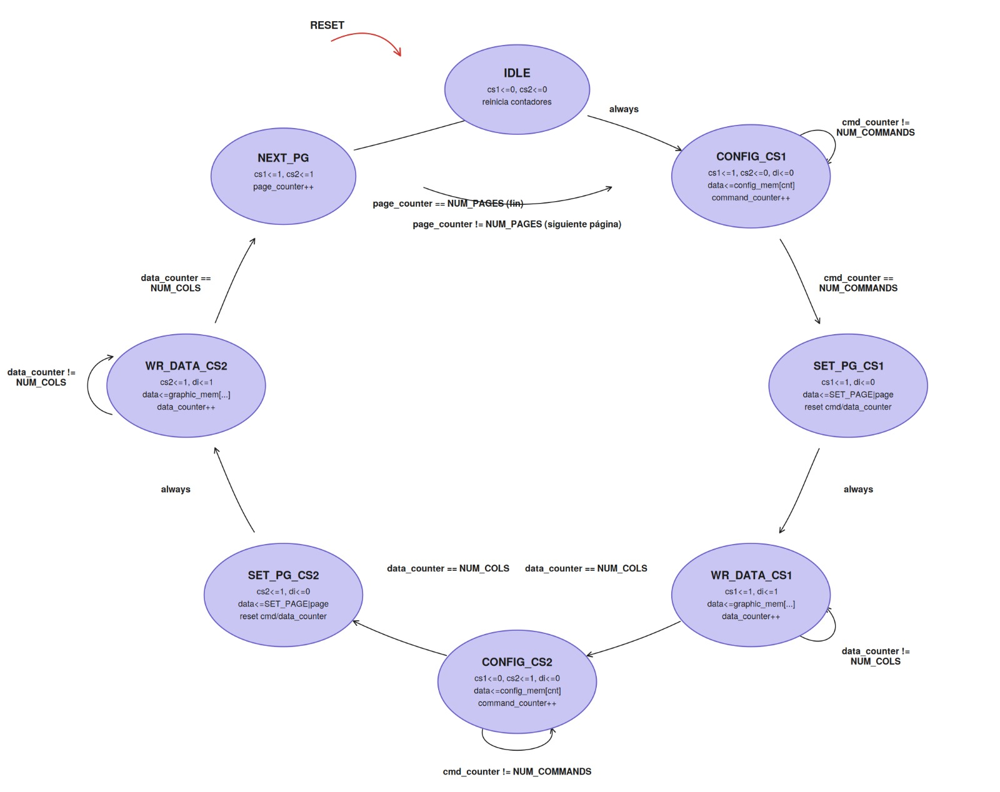

<b>Teclado matricial</b>

  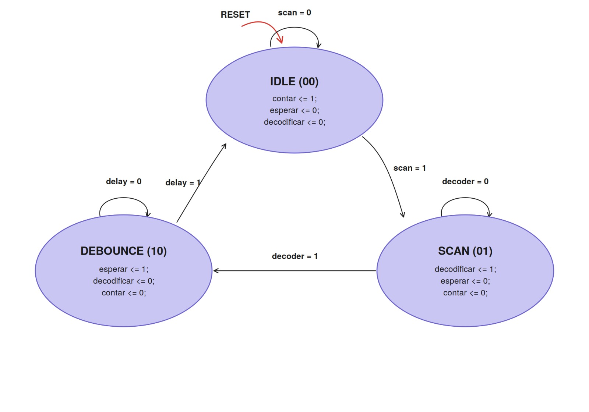

<b>Cambio de pantallas / menú principal</b>

  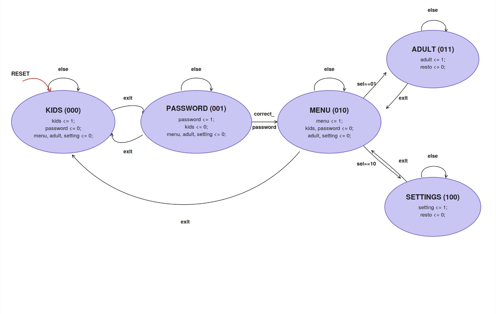

<b>Botones PLAY/PAUSE</b>

  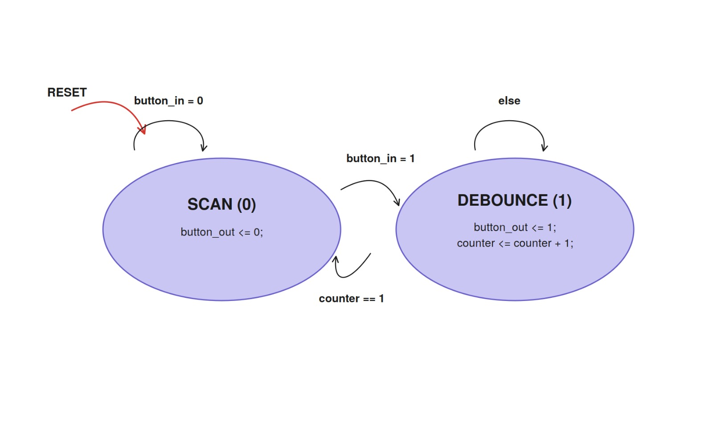

<b>Configuración (Settings)</b>

  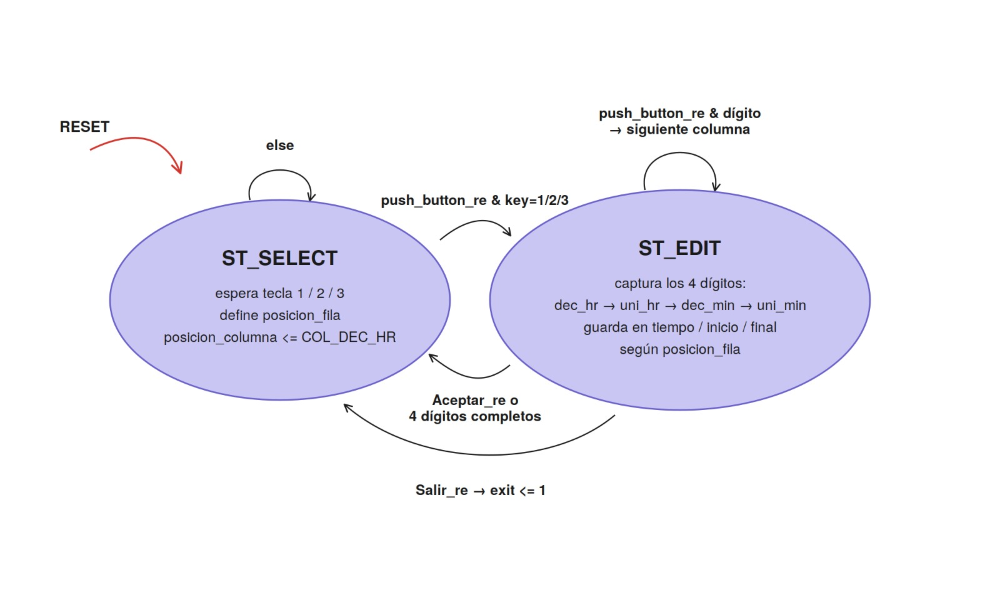

---

## Hardware y circuito

El sistema utiliza una FPGA Cyclone IV como unidad de control central, conectada a:

- **Teclado matricial 4×4** y **switches PLAY/PAUSE** — entrada de usuario
- **Módulo RTC DS1302** — actualiza la hora real de forma autónoma
- **Módulo de relé (optoacoplado)** — corta la alimentación del televisor (cargas de mayor voltaje)
- **Pantalla LCD gráfica 128×64** — interfaz visual

  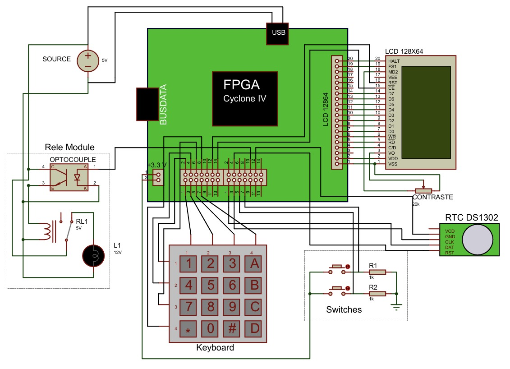
  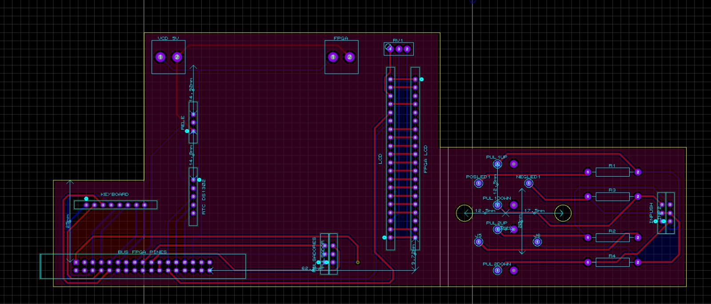

---

## Modelado 3D / Carcasa

Carcasa diseñada para alojar la FPGA, el módulo de relé, el RTC, el teclado matricial y la pantalla LCD de forma compacta.

  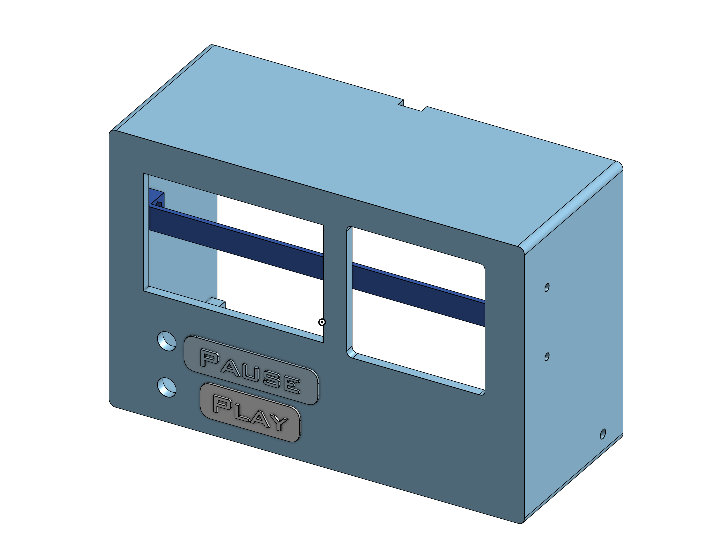
  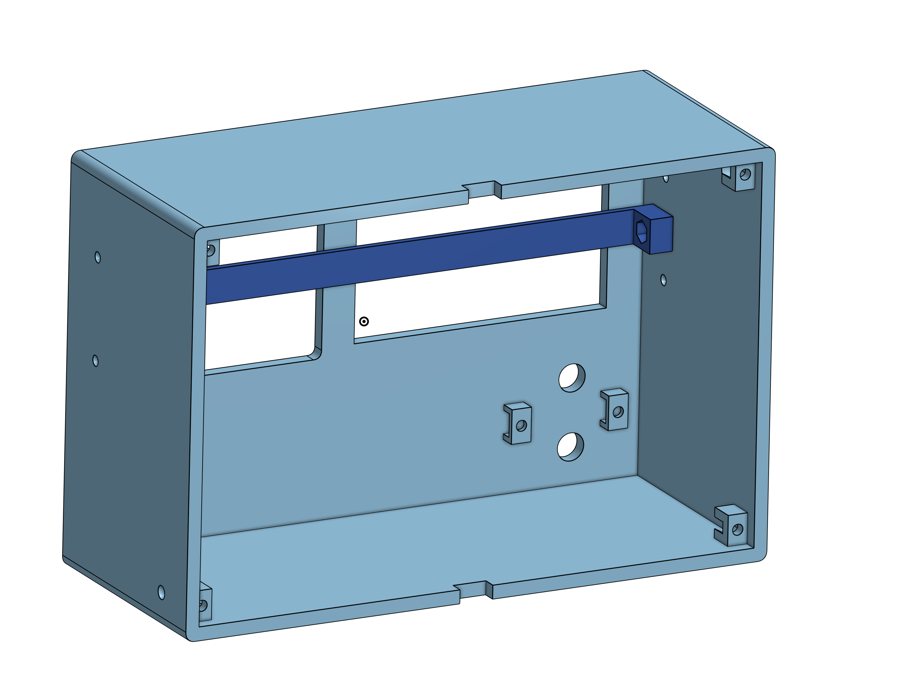

  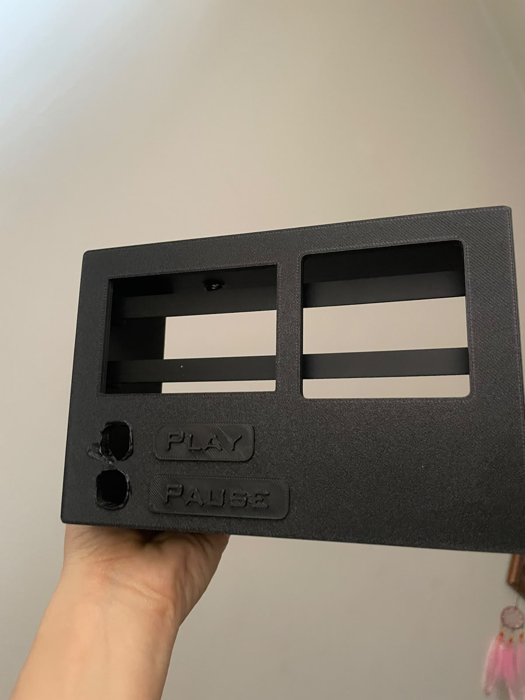

---

## Pruebas y validación

El desarrollo se realizó de forma **incremental**: cada módulo se validó de manera independiente antes de la integración completa en protoboard y, posteriormente, en PCB.

- ✅ **Teclado matricial** — respuesta correcta a las 16 teclas, debounce sin lecturas repetidas.
- ✅ **RTC DS1302** — hora coincidente con la referencia, actualización cada segundo, persistencia tras cortes de energía (batería de respaldo).
- ✅ **LCD 128×64** — inicialización correcta de ambos controladores (CS1/CS2) y escritura precisa de las 5 interfaces.
- ✅ **Control parental** — acceso solo con contraseña correcta; mensaje `INCORRECT` ante clave inválida sin bloquear el sistema.
- ✅ **Settings** — desplazamiento automático de cursor, saturación de valores fuera de rango (formato 24h).
- ✅ **Timer y relé** — inicio/pausa sin pérdida de tiempo acumulado, franjas nocturnas (cruce de medianoche), corte inmediato al agotar el tiempo, reinicio diario automático a las 00:00.

---

## Videos de funcionamiento
 
Video corto que muestran el sistema en operación real sobre protoboard/PCB.
 

      <b>Ingreso de contraseña</b>  
      <video src="Imagenes/prueba.mp4" controls></video>

## Resultados

El sistema cumple satisfactoriamente los objetivos planteados, logrando un dispositivo **funcional, modular y de fácil mantenimiento**, gracias al uso de máquinas de estados finitos independientes por módulo y su integración bajo una FSM principal de navegación.

---

## Uso de IA

Como herramienta de apoyo se utilizó **Claude**, principalmente para la verificación de sintaxis de los módulos en Verilog, el análisis de errores de compilación en Quartus, la identificación de inconsistencias en la descripción de hardware, ayuda en la estetica del repositorio de GitHub y la generación de los diagramas de las máquinas de estado presentados en este documento.

---

## Referencias

1. E. S. Sánchez, *Infancia y medios audiovisuales: análisis sobre la oferta de contenidos dirigidos a niños, niñas y adolescentes en televisión abierta*, Informe final de consultoría, CRC, Bogotá, 2024.
2. American Academy of Child and Adolescent Psychiatry, "Screen Time and Children," *Facts for Families* No. 54, jun. 2025.
3. MinhTran, [DS1302_Interface_DE10](https://github.com/MinhTran0911/DS1302_Interface_DE10) — GitHub.
4. D. Harris y S. Harris, *Digital Design and Computer Architecture*, Elsevier.
5. Dallas Semiconductor, [DS1302 Trickle-Charge Timekeeping Chip — Datasheet](https://www.analog.com/media/en/technical-documentation/data-sheets/ds1302.pdf).
6. HandsOn Technology, [128×64 Dot Graphic LCD Module — User Guide](https://www.handsontec.com).
